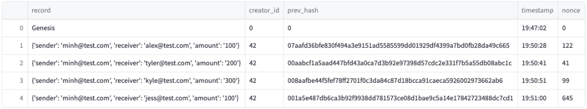
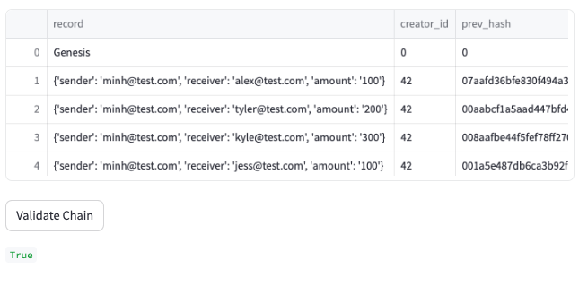

# PyChain Ledger

This challenge aims to create a secure, transparent, and decentralized ledger system that enables partner banks to conduct financial transactions and verify data integrity. By harnessing the power of blockchain, we can provide a tamper-resistant and auditable ledger that enhances trust among financial institutions.

In the the basic `PyChain` ledger structure, I have made the following modifications:

1. Create a new data class named `Record`.

2. Modify the existing `Block` data class to store `Record` data.

3. Add Relevant User Inputs to the Streamlit interface.

4. Test the PyChain Ledger by Storing Records.

## Streamlit Interface

The following clip is a demo of using Streamlit and storing some mined blocks in my `PyChain` ledger, using the following steps:

1. In the terminal, navigate to the folder of `pychain.py`, run the Streamlit application by using `streamlit run pychain.py`

3. Enter values for the sender, receiver, and amount, and then click the Add Block button. Do this several times to store several blocks in the ledger.

4. Verify the block contents and hashes in the Streamlit dropdown menu. 

5. Test the blockchain validation process by using the web interface. 

## Blockchain

The following is a screenshot of the Streamlit application page, which details a blockchain that consists of multiple blocks. 

## Validity 

The following is a screenshot of the Streamlit application page, which indicates the validity of the blockchain. 

